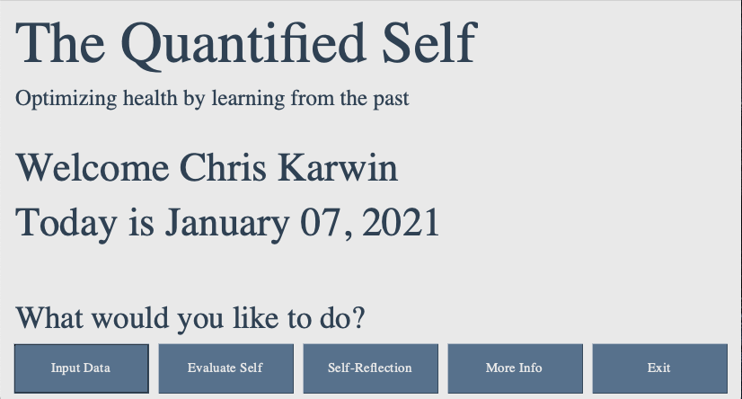

# The Quantified Self 
### Optimizing health by learning from the past

## Basic Overview  
The Quantified Self is a holistic health program that seeks to optimize personal well-being by continually aquiring data of the key trackers that contribute to one's overall health. Importantly, the data is perpertually analyzed using state-of-the-art machine learning algorithms in order to make recommendations by which the user's health will be optimized. These recommendations pertain directly to the daily choices that each individual makes. The central idea of this program is that it is not enough to simply track one's data; rather, self-improvement can only be obtained by learning from the past. 

## Tracked Quantities  

In general, there is a broad range of quantities a user may be interested in tracking. Some of these may include

* heart rate
* blood pressure
* weight
* sleep
* steps
* mindfullness
* nutrition

Additionally, there are other quantities that will be more specific to each user. For example, there may be a particular bad habit that one is working to overcome. It would thus be beneficial to track days as a binary (either true or false) for which they were able to practive restraint from the deleterios habbit. In this case the user can define a **value** called **restraint** which has inputs of either 0 or 1. Such a specialized tracker could be anything, e.g. work time, music practice, famility time, exercise, etc. The Quantified Self allows the user to easily define the quantities they want to track, and this ability to be personalized is a key ability of the code.   

## Interfacing with Apple Health Data  

The current version of the code is compatible with **Apple Health** and the app **Health Auto Export to CSV** (available [here](https://apps.apple.com/us/app/health-auto-export-to-csv/id1115567069)). In general, there are many different apps that one may use to track different quantities. These are all integrated via Apple Health into a single user interface that contains everything, i.e. one doesn't need to track the data over the numerous apps. The Health Auto Export app synces the data in real time with a user's iCloud Drive. Finaly, The Quantified Self then synces with one's health data through their iCloud drive, which is direclty accesible on there laptop and/or desktop. Note that since the program is ran from the user's computer, and interfaces entirely through Apple applications, the software does not introduce any increased risk to thier data privacy. In summary, to synce the code with your health data, the following steps must be taken:

<pre>
 1. Download the Health Auto Export to CSV app, available on Apple iPhone and Apple Watch
    - Allow the app to access Apple Health data
    - Synce the app with iCloud Drive
  
 2. Find the path to iCloud Drive on your laptop/desktop:
    - Should look something like this: "/Users/chriskarwin/Library/Mobile Documents/iCloud~com~ifunography~HealthExport/Documents/"
  
 3. Upon first using the code you will be prompted to enter the above path 
</pre>

