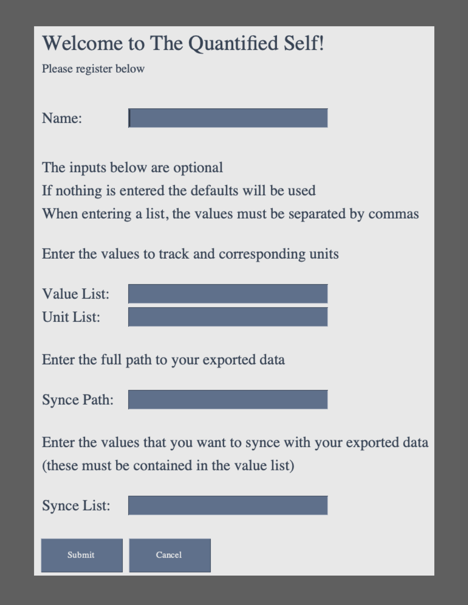

# The Quantified Self 
### Optimizing health by learning from the past

## Basic Overview  
The Quantified Self is a holistic health program that seeks to optimize personal well-being by continually aquiring data of key trackers that contribute to one's overall health. Importantly, the data is analyzed daily using deep learning algorithms in order to make recommendations by which the user's health will be optimized. These recommendations pertain directly to the daily choices that each individual makes. The central idea of this program is that it is not enough to simply track one's own data; rather, self-improvement can only be obtained by learning from the past. The concepts behind The Quantified Self are in essence the foundation of preventive health care. 

## Interfacing with Apple Health Data  

The current version of the code is only compatible with **Apple Health** and the **Health Auto Export to CSV** app (available [here](https://apps.apple.com/us/app/health-auto-export-to-csv/id1115567069)). In general, there are many different apps that one may use to track different quantities. However, these are all integrated via Apple Health into a single user interface that contains everything, i.e. one doesn't need to monitor the data over the numerous tracking apps. The Health Auto Export app synces the data in real time with a user's iCloud Drive. Likewise, The Qunatified Self connects with the user's health data through their iCloud drive, which is direclty accesible on their laptop/desktop. Note that since the program is ran from the user's computer, and interfaces entirely through Apple applications, the software does not introduce any increased risk to thier data privacy. In summary, to sync the code with your health data, the following steps must be taken:

<pre>
 1. Download the Health Auto Export to CSV app, available on Apple iPhone and Apple Watch
    - Allow the app to access Apple Health data
    - Synce the app with iCloud Drive
  
 2. Find the path to iCloud Drive on your laptop/desktop:
    - Should look something like this: "/Users/chriskarwin/Library/Mobile Documents/iCloud~com~ifunography~HealthExport/Documents/"
  
 3. Upon first using the code you will be prompted to enter the above path 
</pre>

## Input Data  

In general, there is a broad range of quantities a user may be interested in tracking. Some of these may include

* heart rate
* blood pressure
* o2 levels
* weight
* sleep
* steps
* mindfullness
* nutrition

Additionally, there are other quantities that will be more specific to each user. The Quantified Self allows the user to define their own set of values they wish to track, allowing the code to be specialized to each user's health needs/goals.

## Health Evaluation  

There are four values that quantify a user's health: 

* **Physical Health**: the body
* **Mental Health**: the brain
* **Spiritual Health**: the soul (there are many synonyms for this)
* **Happiness**: one's overall state of joy, fulfillment, content, security, peace, etc. (in part, a wieghted sum of the first three evaluation variables)

These parameters should range from 0-10, and they are the subjective evaluations to be determined by the user. Ideally, health evaluations should be made daily. These are the parameters that will be optimized over time, according to the input data. As the algorithm learns the input values that maximize the health parameters, it will begin to make recommendations as to future behavours that should be taken. 

The four health parameters listed above are in essence the most general components that characterize one's holistic self. In future versions of the code, the health evaluation inputs should be developed further. In particular, users will have specific parameters that will best quantify thier overall well-being, e.g. they may be focused towards certain diseases such as diabetes, obesity, heart disease, etc. 

Note: the learning algorithm has not yet been applied to the code. 

## Quickstart Guide  

<pre>
1. Download the source code (<b>The_Quantified_Self_0.1.py</b>) and the sync file (<b>sync.csv</b>)
     - the code requires python3
     - the sync file is required for syncing with Apple Health data
     - it's best to run the code from its own dedicated directory

2. The user interacts with the code via the python API (a better option will be available in future versions of the code)
     - it can be envoked either from the terminal or the desktop
     - to run from the desktop: right click python file --> Get Info --> Open with --> set to Python Launcher 3
     
3. Upon first starting the code, the registration screen will appear, as shown below
     - the values that can be synced are found in sync.csv; I've only added a few, but more can easily be added
     - to re-register remove the directories "My_Info" and "My_Data" (a better option will be available in future versions of the code)

4. The main user interface is shown below
     - The synced values will automatically update each day
     - The daily input data is stored in a csv file in "My_Data", and can be directly modified if needed (a better option will be available in future versions of the code)
     - When a tracker is clicked in the "Self Reflection" tab, a plot will appear showing the data
     - The user can specify the time range  of the plot as either day (D), week (W), month (M), year (Y), or all data (A)

</pre>

## Registration Screen

## Main User Interface

## Ongoing Developments  

* Implement the deep learning algorithm.
* Allow user to easily update/modify thier info and data. 
* Allow the user to easily print a health summary, which can be shared with thier physician, etc.
* Implement a device/application that continually monitors the user's blood levels, allowing for early diagnosis of abnormalities.
* Integrate The Quantified Self into a single central hub for all medical data. Define a "health score" that can be used as an incentive by health insurance companies.
* Integrate The Quantified Self into a larger program. So far, this will include a daily planner application and a finance application. 
