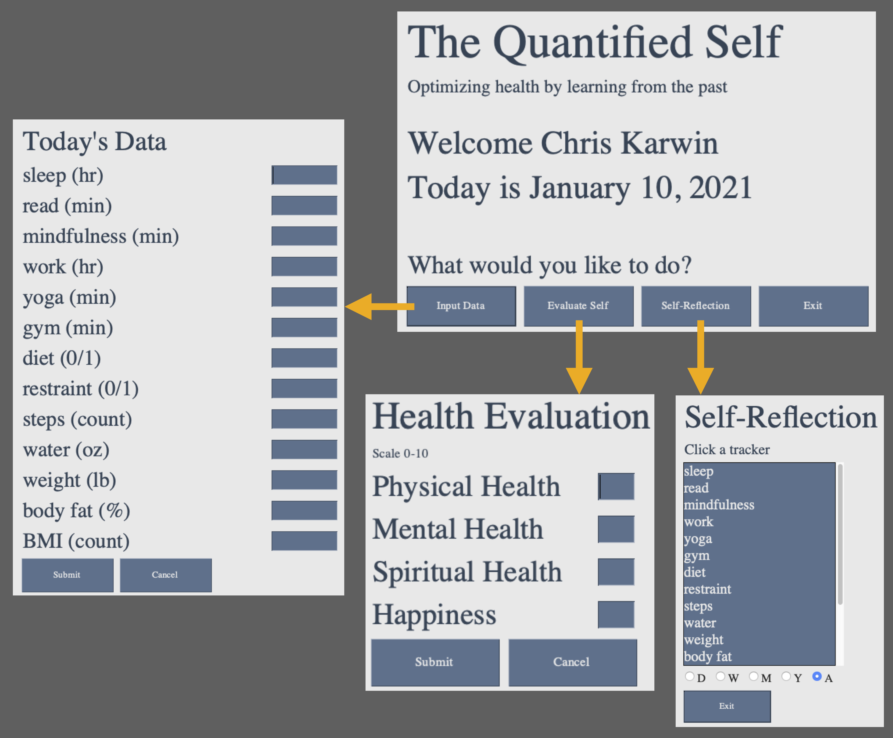

# The Quantified Self 
### Optimizing health by learning from the past

## Basic Overview  
The Quantified Self is a holistic health program that seeks to optimize personal well-being by continually aquiring data of key trackers that contribute to one's overall health. Importantly, the data is analyzed daily using deep learning algorithms in order to make recommendations by which the user's health will be optimized. These recommendations pertain directly to the daily choices that each individual makes. The central idea of this program is that it is not enough to simply tracking one's own data; rather, self-improvement can only be obtained by learning from the past. The concepts behind The Quantified Self are in essence the foundation of prevantative health care. 

The code is still early in its beta phase (which is also true for the movement at large), and it will become increasingly impactful the more user-friendly it becomes. A major limiting factor for this is the user input. The code should seek to track desired quantities in an automated way, with as little user interaction as possible. To this end, one key development may come from voice command applications. Specifically, there are currently a number of trackers that can only be input by hand (e.g. mindfulness time, nutrition, etc.), although a simple voice command (recorded by a smart watch or similar devive) would make tracking such quantities much more efficient. 

## Interfacing with Apple Health Data  

The current version of the code is only compatible with **Apple Health** and the **Health Auto Export to CSV** app (available [here](https://apps.apple.com/us/app/health-auto-export-to-csv/id1115567069)). In general, there are many different apps that one may use to track different quantities. However, these are all integrated via Apple Health into a single user interface that contains everything, i.e. one doesn't need to monitor the data over the numerous tracking apps. The Health Auto Export app synces the data in real time with a user's iCloud Drive. Likewise, The Qunatified Self connects with the user's health data through their iCloud drive, which is direclty accesible on their laptop/desktop. Note that since the program is ran from the user's computer, and interfaces entirely through Apple applications, the software does not introduce any increased risk to thier data privacy. In summary, to synce the code with your health data, the following steps must be taken:

<pre>
 1. Download the Health Auto Export to CSV app, available on Apple iPhone and Apple Watch
    - Allow the app to access Apple Health data
    - Synce the app with iCloud Drive
  
 2. Find the path to iCloud Drive on your laptop/desktop:
    - Should look something like this: "/Users/chriskarwin/Library/Mobile Documents/iCloud~com~ifunography~HealthExport/Documents/"
  
 3. Upon first using the code you will be prompted to enter the above path 
</pre>

## Tracked Quantities  

In general, there is a broad range of quantities a user may be interested in tracking. Some of these may include

* heart rate
* blood pressure
* o2 levels
* weight
* sleep
* steps
* mindfullness
* nutrition

Additionally, there are other quantities that will be more specific to each user. The Quantified Self allows the user to define their own set of values they wish to track, allowing the code to be specialized to each user's health goals/needs.    

